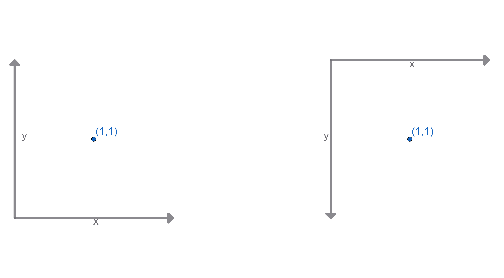

import CodeSnippet from '@components/code-snippet';
import Vector from '@code/tab/graphics/math/vector.ixx?raw';

A vector is a concept from linear algebra and we can say it forms the base of computer graphics. According to [Wikipedia](https://en.wikipedia.org/wiki/Vector_(mathematics_and_physics)), "**vector** is a term that refers to quantities that cannot be expressed by a single number (a scalar), or to elements of some vector spaces". In computer graphics, we usually stick to the second definition: a vector is an element of a geometric space, which most of the times is bidimentional (2D) or tridimentional (3D). We also use 4D vectors, not to represent an element of a 4-dimention geometric space, but rather to perform some operations in 3D space. I'm using the word "element" instead of "position" because vectors can both positions and directions.

## 2D Vector
Thinking about 2D space, we usually call its 2 axes $$x$$ and $$y$$. The $$x$$ axis points to the right, while the $$y$$ axis can point up or down, depending on the context: when talking about geometric space, it usually points upwards, on the other hand, if we're talking about coordinates in an image or in a screen, it points downwards.

To implement a 2D vector, let's start with the constructors: a default constructor to assing $$0$$ to $$x$$ and $$y$$ and another one to assing specific values.
<CodeSnippet source={Vector} startMarker="start-constructors" endMarker="end-constructors" sourcePath="tab/graphics/math/vector.ixx"/>

Next, we can define simple arithmetic operations between vectors, such as addition, subtraction, multiplication and division. We'll also define negation:
<CodeSnippet source={Vector} startMarker="start-basic-ops" endMarker="end-basic-ops" sourcePath="tab/graphics/math/vector.ixx"/>

We can also scale a vector, which is equivalent to multiply or divide its components by a single number:
<CodeSnippet source={Vector} startMarker="start-scalar-ops" endMarker="end-scalar-ops" sourcePath="tab/graphics/math/vector.ixx"/>

Defining equality rules is useful. We can't, however, easily define ordering rules. How do we define what makes a vector bigger than another: should we compare them componentwise? Or should we sum the values of each component? Or something else? While there is no definitive answer to that, you can implement your own ordering rules according to your application needs. You might ask why would you want to have ordering rules? Well, sometimes you might want to sort vectors in a list. 
<CodeSnippet source={Vector} startMarker="start-equality" endMarker="end-equality" sourcePath="tab/graphics/math/vector.ixx"/>

Now, let's write two more functions: the first calculates the vector length, or its **magnitude**. If you imagine that the vector represents a position in space, its length would be its distance from the origin $$(0,0)$$, which is calulated by taking the square root of the sum of the squares of its components, or in other words, $$\sqrt{x^2 + y^2}$$. The second function returns a normalized vector, which is a vector that points to the same direction, but has length equals to $$1$$. 
<CodeSnippet source={Vector} startMarker="start-length-ops" endMarker="end-length-ops" sourcePath="tab/graphics/math/vector.ixx"/>

There's one last operation that we'll implement (for now): the **dot product**. This operation gives us the angle between two vectors or, more precisely, the cosine of the angle multiplied by both vectors lengths. A more formal definition is as follows:
$$$
\mathbf{a}\cdot\mathbf{b}=\sum_{i=1}^n{a_ib_i}
$$$

Let me translate this expression for you: the dot product of any two vectors with $n$ dimensions (yes, this operation is defined for any number of dimensions!) is the sum their components multiplied in pairs. Translating it to code, we would have something like this:
<CodeSnippet source={Vector} startMarker="start-dot" endMarker="end-dot" sourcePath="tab/graphics/math/vector.ixx"/>

## 3D Vector

Let's go one dimention up!

Now we have three axes, two of which we've already named, and a third one usually called $$z$$. Now, the question of which axis points to which direction has gotten more complex. If you take a piece of paper and draw the $$x$$ axis point to the left and the $$y$$ axis pointing up, the $$z$$ axis could be either coming out of the paper or "diving deep". Most mathematics, physics and computer graphics conventions would agree that the $$z$$ axis is coming out of the paper towards you, which is called the [right-hand rule](https://en.wikipedia.org/wiki/Right-hand_rule).

There's one more question: is your piece of paper on top of a table on hanging on the wall? In the first case, the $$z$$ axis points up, in the second case, it's the $$y$$ axis that points up. There's no clear consensus regarding which one is preferable. For instance, in [Blender](https://www.blender.org/) $$z$$ is up, whereas in [Unity](https://unity.com/) it's $$y$$.

The code for a 3D vector is almost identical to the code for the 2D vector, with only straightforward adaptations (like including $$z$$ in the calculations). The only major difference is that, for 3D vectors, we have a new operation called **cross product**. This operation results in a ortogonal vector from two given vectors and is implemented as follows:
<CodeSnippet source={Vector} startMarker="start-cross" endMarker="end-cross" sourcePath="tab/graphics/math/vector.ixx"/>

## 4D Vector
I'll start by answering the question: "Why would I need a 4D vector for 3D graphics?". The answer has two words: **homogeneous coordinates**.

How useful they are will become apparent when you learn about vector transformations such as translation, rotation, scaling and projection (I'll write about it someday). Besides that, it also allows you to distinguish 3D vectors that represent positions from the ones that represent directions!

For now, it's enough to say that 4D vectors are implemented just like the 2D vectors, with the addition of two axes: $$z$$ and $$w$$. "Wait!", you might be thinking, "shouldn't 4D vectors be like 3D vectors?". Well, the truth is that, for now, 4D implementation is closer to 2D than 3D implementations just because there is no cross product for 4D vectors. In fact, it has been proven that there is no cross product for any vector spaces besides 3D and 7D!

## What's next?
I've just explained how to implement basic operations for vectors. But there is much more!

From here, you could try the following:
- use matrices to transform (move, scale and rotate) vectors;
- implement other operation such as reflection and refraction;
- implement arithmetic operations using AVX or other set of SIMD instructions (a type of parallel processing);